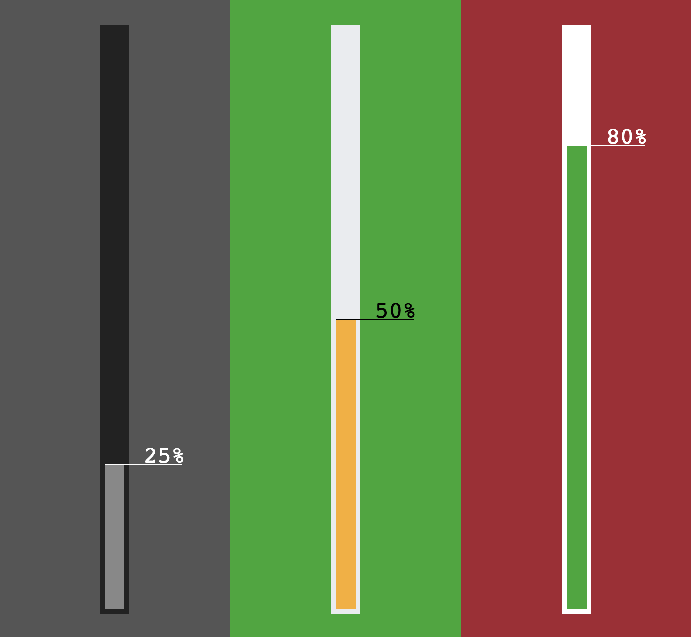

# Progress Bar Web Component

This is a custom HTML element called `progress-bar` that you can use to display a progress bar on your web page. This progress bar can be customized with different attributes to control its appearance. Below, you'll find information on how to use and customize the `progress-bar` element.



## Usage

To use the `progress-bar` element, include it in your HTML code like this:

```html
<progress-bar
    id="progressBar2"
    bar-color="#fbad23"
    bg-color="#e9ecef"
    text-color="#000000"
    percent="50"
></progress-bar>
```

You can place this code within the `<body>` of your HTML document.

## Attributes

The `progress-bar` element supports the following attributes:

- `id`: This attribute specifies the ID for the progress bar element.

- `bar-color`: This attribute sets the color of the progress bar itself.

- `bg-color`: This attribute sets the background color of the progress bar.

- `text-color`: This attribute sets the color of the text displayed within the progress bar.

- `percent`: This attribute determines the current progress percentage of the bar.


## JavaScript Implementation

The `progress-bar` element is implemented as a custom HTML element using JavaScript. The JavaScript class `ProgressBar` defines the behavior and appearance of the progress bar.

If you wish to customize the behavior or appearance of the `progress-bar` element further, you can modify the JavaScript code provided in the `ProgressBar` class.

## Demo

* https://andersdeath.github.io/progress-bar-webcomponent/
## Compatibility

Please note that custom HTML elements like `progress-bar` may not be fully supported in all web browsers. Before using this element, make sure to check for browser compatibility or consider using a polyfill for older browsers.

## License

This code is provided under MIT license. You are free to use and modify it according to your needs.